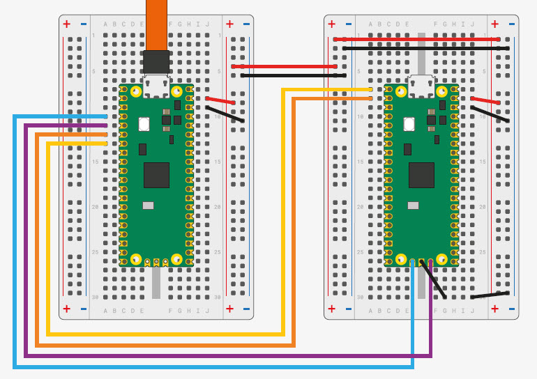
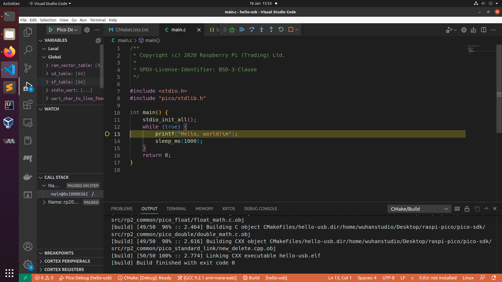

# Raspberrypi Pico Debug in VSCode

Step 1: Install gcc toolchain.

```
$ sudo apt-get install gcc-arm-none-eabi gdb-multiarch
$ ln -s /usr/bin/gdb-multiarch /usr/bin/arm-none-eabi-gdb
```

Step 2: Build OpenOCD for raspi pico.

```
$ sudo apt install automake autoconf build-essential texinfo libtool libftdi-dev libusb-1.0-0-dev
$ git clone https://github.com/raspberrypi/openocd.git --branch picoprobe --depth=1 --no-single-branch
$ cd openocd
$ ./bootstrap
$ ./configure --enable-picoprobe
$ make -j4
$ sudo make install

$ sudo cp contrib/60-openocd.rules /etc/udev/rules.d/
$ sudo usermod -aG plugdev `whoami`
```

Step 3: Build and upload picoprobe.

```
$ git clone https://github.com/raspberrypi/picoprobe.git 
$ cd picoprobe 
$ mkdir build 
$ cd build 
$ Cmake -G “Unix Makefiles” .. 
$ make
```

Put your debugger Pico into bootloader mode by pressing and holding the **BOOTSEL** button while plugging in the USB cable. Then copy the firmware **picoprobe.uf2** to the **RPI-RP2** drive.



You can test the connection using:

> The config `-c "adapter speed 5000"` is very important. Without it, you will see the error:
> **Can't find a picoprobe device! Please check device connections and permissions.**

```
$ /usr/local/bin/openocd -f interface/cmsis-dap.cfg -f target/rp2040.cfg -s tcl -c "adapter speed 5000"
```

Step 4: Install VSCode Cortex-Debug Extension.


